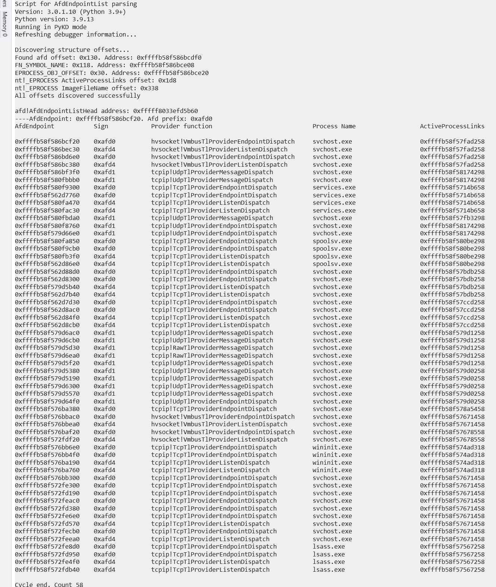

# Scripts for Hyper-V researching

Different scripts for Microsoft Hyper-V internals researches. Folder ida75 contains scripts, which is compatible with IDA PRO 7.5

- CreatemVmcallHandlersTable20H1.py - IDA Python script for extracting hvcalls from hvix64.exe, hvax64.exe Windows 10 20H1
- CreatemVmcallHandlersTable21H1.py - IDA Python script for extracting hvcalls from hvix64.exe, hvax64.exe Windows 10 21H1 (only 7.5)
- CreatemVmcallHandlersTable2016.py - IDA Python script for extracting hvcalls from hvix64.exe, hvax64.exe Windows Server 2016
- CreatemVmcallHandlersTable2019.py - IDA Python script for extracting hvcalls from hvix64.exe, hvax64.exe Windows Server 2019

For latest Windows versions (Windows Server 2022 and Windows 11) and older Windows version with fresh patches, i recommend to use extract_hvcalls or extract_hvcalls_gui scripts, which are dynamically extract new hypercalls.
Extract_hvcalls_gui video demonstration: https://www.youtube.com/watch?v=ohO4Hs4y59M 

- ParseAfdEndpointListHead.py - script for parsing afd!AfdEndpointListHead structure (WinDBG + pykd)

- ParseAfdTlTransportListHead.py - script for parsing afd!AfdTlTransportListHead (WinDBG + pykd)

