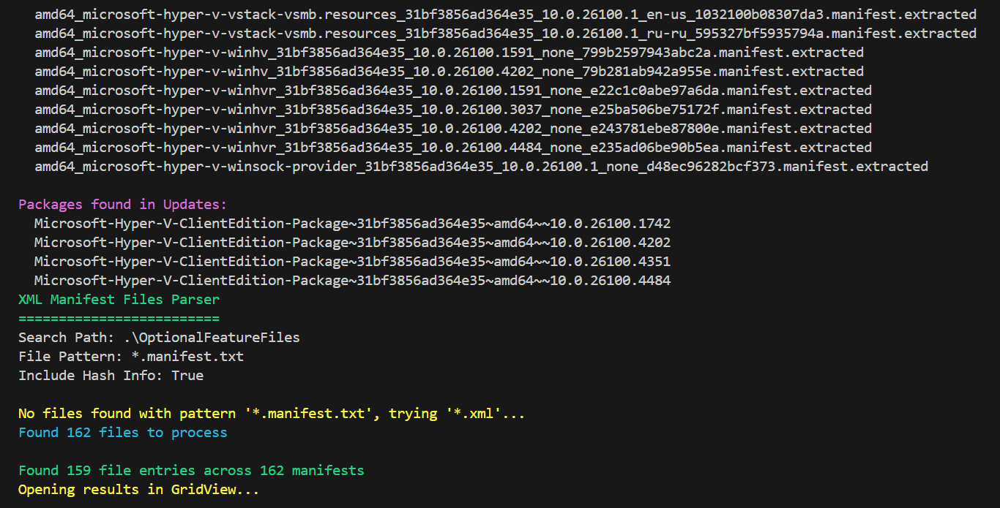
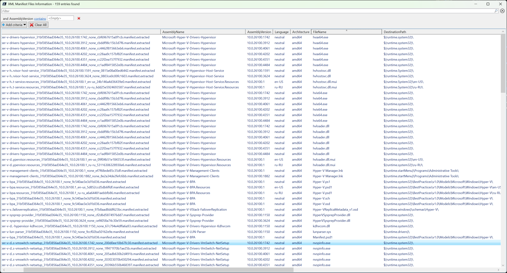

# Spider Stone
Windows Optional Feature Files Finder and Extractor (v0.0.1)





## Script Overview

Extracts and analyzes Windows Optional Feature manifest files from the system registry and WinSxS store.

---

### Requirements
 PowerShell 5.0 or later  
 wcpex utility for decoding Windows manifest files: https://github.com/smx-smx/wcpex  

---

### Description
This script identifies, extracts, and analyzes Windows Optional Feature manifest files from the system. It searches the Windows registry for feature-related packages, copies the corresponding manifest files from the WinSxS store to separate folder and aggregate information from this files in table.

### Requirements
- **Administrator Privileges**: Required for registry access
- **Windows OS**: Designed for Windows systems with WinSxS store
- **wcpex.exe**: Must be present in script directory for extraction
- **PowerShell 5.0+**: With .NET XML processing capabilities

### Parameters

| Parameter | Type | Required | Default | Description |
|-----------|------|----------|---------|-------------|
| `FeatureName` | String | Yes | - | Name of the Windows Optional Feature |
| `OutputDirectory` | String | No | `".\OptionalFeatureFiles"` | Directory for extracted files |
| `VerboseOutput` | Switch | No | `$false` | Enable detailed progress output |

### Usage Examples

```powershell
# Extract WSL (Windows Subsystem for Linux) manifests
.\Spider-Stone.ps1 -FeatureName "Microsoft-Windows-Subsystem-Linux"

# Custom output directory with verbose logging
.\Spider-Stone.ps1 -FeatureName "Microsoft-Windows-Subsystem-Linux" -OutputDirectory "C:\WSLManifests" -VerboseOutput

# Extract Telnet client manifests
.\Spider-Stone.ps1 -FeatureName "TelnetClient" -OutputDirectory ".\TelnetFiles" -VerboseOutput

# Extract Hyper-V feature manifests
.\Spider-Stone.ps1 -FeatureName "Microsoft-Hyper-V" -VerboseOutput
```

### Process Flow
1. **Registry Validation**: Checks if feature exists in OptionalFeatures registry
2. **Manifest Copy**: Copies found manifest files to output directory
3. **File Extraction**: Uses wcpex.exe to extract compressed manifests
4. **Content Analysis**: Parses extracted files and displays results in Powershell GridView

### Output Files
- **\*.manifest**: Original compressed manifest files
- **\*.manifest.extracted**: Decompressed XML content
- **GridView Display**: Interactive table showing file information

---

## Common Requirements

### System Requirements
- Windows 10/11 or Windows Server 2016+
- PowerShell 5.0 or later
- Administrator privileges (for Feature Extractor)

### Dependencies
- **XML Processing**: Built-in .NET XML capabilities
- **wcpex.exe**: Required for manifest decoding
- **Registry Access**: HKLM access for Feature Extractor

## Installation

1. Download the PowerShell script files
2. For Feature Extractor: Place `wcpex.exe` (and wcp.dll - see README file of that utility for using) in the same directory
3. Run PowerShell as Administrator (for Feature Extractor)
4. Execute scripts with appropriate parameters

## Contributing

When modifying these scripts:
1. Maintain backward compatibility
2. Add appropriate error handling
3. Update parameter documentation
4. Test with various input scenarios
5. Follow PowerShell best practices

## Version History

### XML to CSV Parser
- **Current**: Initial Spider Stone release with comprehensive XML flattening

### Feature Manifest Extractor
- **v0.0.1**: Initial Spider Stone release with registry search and manifest extraction

## Support

For issues or questions:
1. Check error messages for specific guidance
2. Verify administrator privileges (Feature Extractor)
3. Ensure all dependencies are present
4. Review verbose output for detailed information

## License

GPL3